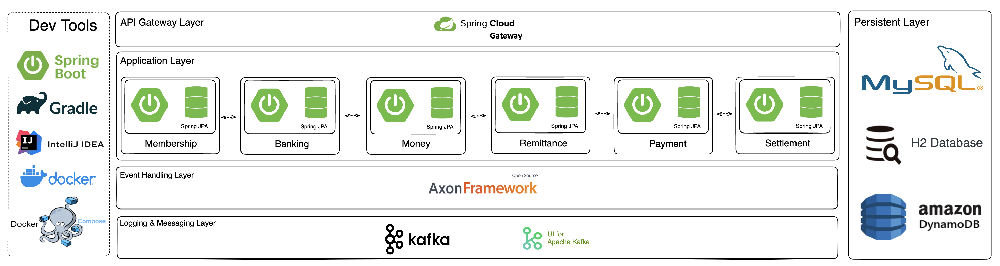
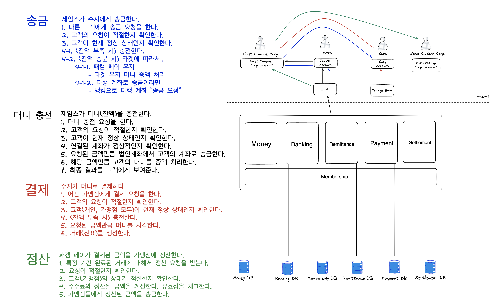
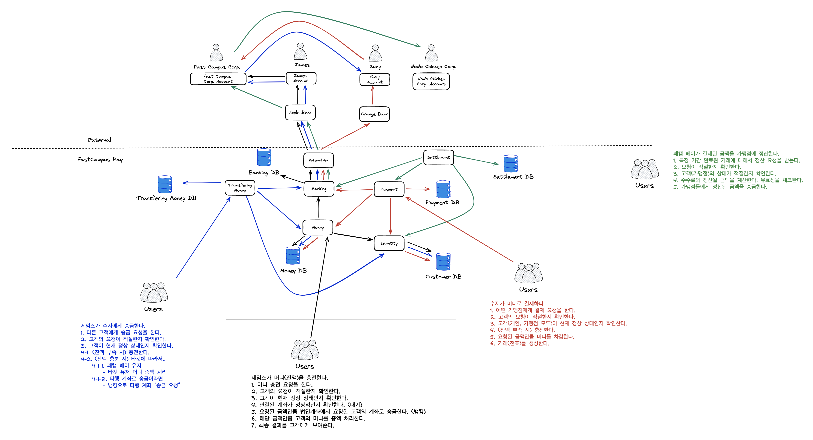
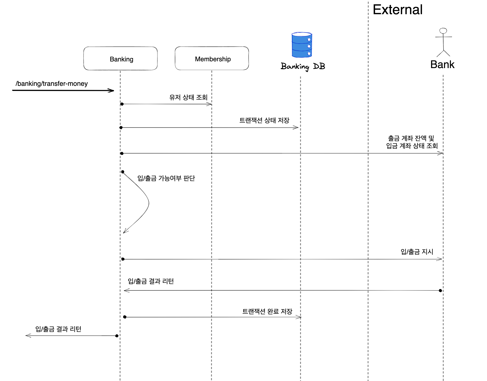
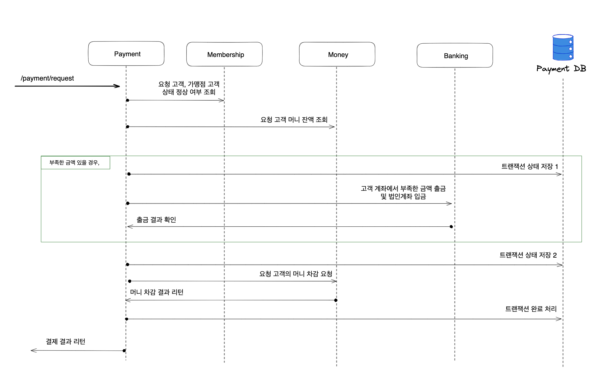
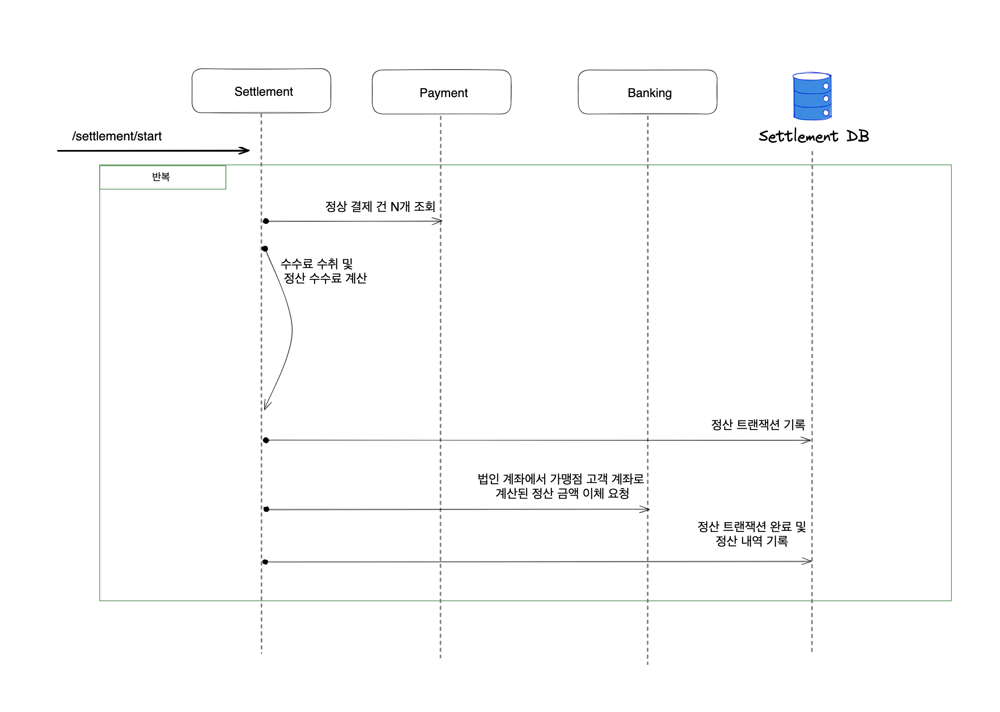
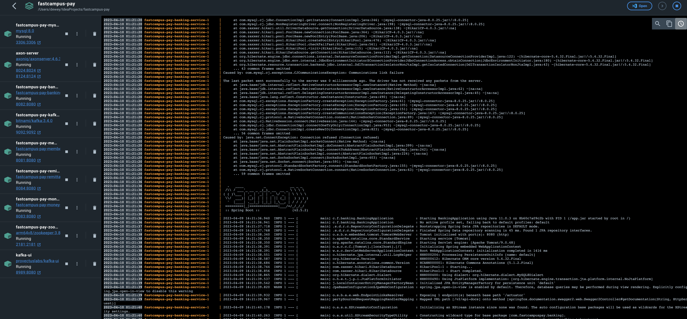
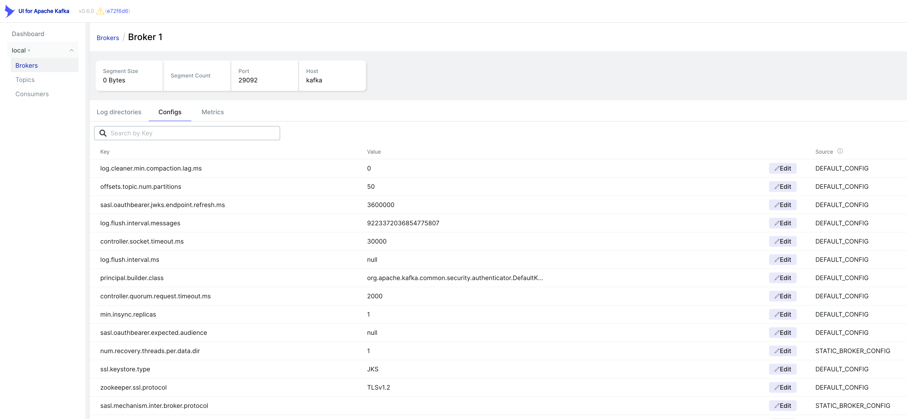
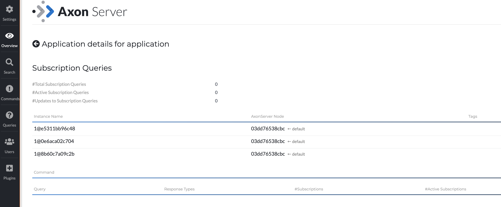
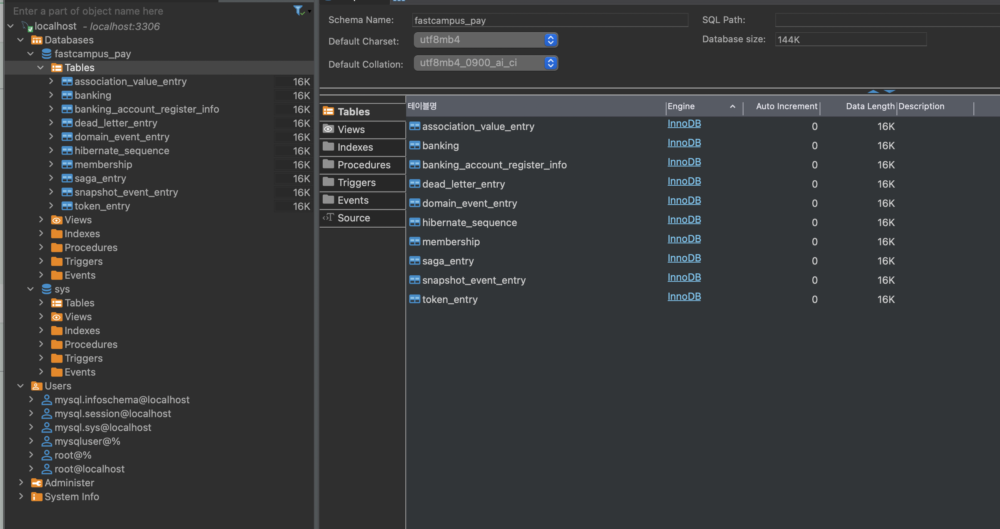

# FastCampus-Pay Project Overview


일반적인 간편결제 도메인을 주제로, MSA 를 중점적으로 학습하기 위한 교육용 프로젝트입니다.

회원(Membership), 뱅킹(Banking), 머니(Money), 송금(Remittance), 결제(Payment), 정산(Settlement) 6개의 서비스로 구성되어 있으며, 각각의 독립적인 프로젝트로 구성되어 있어요.   
각 서비스에서는 기본적인 기능을 먼저 Hexagonal Architecture 로 구현하고, 일부 기능들에 EDA, CQRS, Event Sourcing, Saga Pattern 등을 적용하며 진행해 보아요.

기본적으로 Springboot 와 Java 11 을 기준으로 프로젝트를 구성하고, EDA 구현을 위해서 Axon Framework v4.6.0 을 사용해요.
로깅 파이프라인은 따로 구성하진 않았지만, kafka 의 실습을 목적으로 하는 간단한 로깅 파이프라인을 구성할 예정이에요.

실제 간편 결제 도메인 시스템과는 복잡성 측면에서 차이가 있지만, 간단한 버전을 기준으로 MSA 를 구성하고, 각 서비스의 기능을 구현하며, EDA 를 적용해 보는 것을 목표로 진행해요.
아래 내용들은 수업 진행 방향 및 실습 진행 속도에 따라 유동적일 수 있어요.

## Overall Architecture for Monolithic System


## Overall Architecture for MSA


## Membership Service (Part. 2, 3, 6, 7)
고객의 회원 가입, 회원 정보 변경, 회원 정보 조회 등의 기능을 제공하는 서비스입니다.
- Part 2.
  - Hexagonal Architecture 를 활용하여 기본적인 Membership Service 를 구현 (회원 가입)
- Part 3.
  - gradle build tool 을 이용하여 Docker build 연동. 추가적인 Membership Service 를 구현 (회원 정보 변경)
- Part 6.
  - Axon Framework 를 이용하여 Event Driven Architecture 로 리팩토링. 
  - 고객 정보가 변경될 경우, 이벤트를 발행하고, 이를 구독하는 Money 서비스 에서 고객의 머니 정보를 변경하는 CQRS 패턴 구현 (with/ AWS DynamoDB)
- Part 7.
  -  보안을 위해 JWT 를 이용한 간단한 API 인증 구현

### API Lists
- registerMembership
- updateMembershipByMemberId (CQRS Trigger)
- findMembershipByMemberId
- loginByMembershipIdPw
- authByToken

#### Using Stack
  - Spring Boot, Java 11, Spring Data JPA, H2, Mysql, Lombok, Gradle, JWT, Axon Framework, Docker, Docker Compose, AWS DynamoDB

### Sequence Diagram Example (회원 가입, JWT 토큰 인증 프로세스) 


## Banking Service (Part. 3)
고객의 계좌 정보 등록, 등록된 계좌 정보 조회, 입/출금, 거래내역 조회 등의 기능을 제공하는 서비스입니다.
- Part 3.
  - Hexagonal Architecture 를 활용하여 기본적인 Banking Service 를 구현 (가상의 법인 계좌 및 고객 계좌 정보 등록, 은행으로 입/출금 요청하기)
  
### API Lists
- registerBankingAccount
- requestTransferMoneyToBank
- findRegisteredBankingAccountByMemberId
- findTransferMoneyInfoByMemberId
- findTransferMoneyInfoByBankingId

#### Using Stack
  - Spring Boot, Java 11, Spring Data JPA, H2, Mysql, Lombok, Gradle, JWT, Axon Framework, Docker, Docker Compose

### Sequence Diagram Example (입/출금 요청 프로세스)


## Money Service (Part. 3, 4, 5, 6)
고객의 충전 잔액(머니) CRUD, 충전 내역 조회 등의 기능을 제공하는 서비스입니다.
- Part 3.
  - Hexagonal Architecture 를 활용하여 Membership 서비스 및 Banking 서비스를 이용하는 충전 잔액(머니)을 충전하는 기능 구현
  - 충전 내역 조회 기능 구현
- Part 4.
  - kafka 을 이용한 간단 로깅 파이프라인 적용 (kafka 를 이용한 로깅 파이프라인은 실습을 위한 간단한 구현이며, 실제로는 ELK/EFK 등을 이용한 로깅 파이프라인을 구성하는 것을 추천합니다.)
  - 충전 잔액(머니) 충전 프로세스를 Async 방식으로 구현하고, Polling 을 통한 결과 조회 방식 구현 
- Part 5.
  - 충전 잔액(머니)을 충전하는 기능은 Axon Framework 를 이용하여 Saga Pattern 적용 및 리팩토링
- Part 6.
  - Axon Framework 를 이용하여 Event Driven Architecture 로 리팩토링.
  - Membership 서비스로부터 고객 정보 변경 이벤트를 수신하고, 이를 기반으로 CQRS 패턴을 구현 (with/ AWS DynamoDB)
    - "지역별 고객들의 잔액 총합 View" 을 얻어오려면?
    
### API Lists
- rechargeMoneyByMemberId
- findMoneyInfoByRechargeMoneyId
- findMoneyHistoryByMemberId
- transferMoneyBetweenMembers

### MoneyLocal Service (for CQRS)
- calculateMoneySumByLocal 
- MembershipUpdate (EventHandler)

#### Using Stack
- Spring Boot, Java 11, Spring Data JPA, H2, Mysql, Lombok, Gradle, JWT, Axon Framework, Docker, Docker Compose, Kafka, Kafka-ui, Zookeeper, AWS DynamoDB

### Sequence Diagram Example (충전 잔액(머니) 충전 프로세스)


## Remittance Service (Part. 4, 5, 6)
고객 간 송금 기능 및 송금 내역 정보 조회 등의 기능을 제공하는 서비스입니다.
- Part 4.
  - Hexagonal Architecture 를 활용하여 Membership 서비스, Banking 서비스, Money 서비스를 이용하는 고객 간 혹은 계좌 송금 기능 구현
- Part 5.
  - 고객 간 송금하는 기능은 기능은 Axon Framework 를 이용하여 Saga Pattern 적용 및 리팩토링
- Part 6.
  - 특정 송금 건을 기준으로, 머니의 충전 내역을 조회해보는 기능 구현을 위해 API Aggregation Pattern 적용

### API Lists
- requestRemittance
- findRemittanceInfoByRemittanceId
- findRemittanceHistoryByMemberId
- findMoneyTransferringByRemittanceId (API Aggregation, Banking + Money)

#### Using Stack
- Spring Boot, Java 11, Spring Data JPA, H2, Mysql, Lombok, Gradle, JWT, Axon Framework, Docker, Docker Compose, AWS DynamoDB

### Sequence Diagram Example (송금 프로세스)


## Payment Service (Part. 5)
가맹점에서 Fastcampus Pay 를 이용한 간편 결제 및 결제 내역 조회 등의 기능을 제공하는 서비스입니다. 
- Part 5.
  - Hexagonal Architecture 를 활용하여 Membership 서비스, Money 서비스를 이용하는 가맹점에서의 결제 기능 구현
  - Membership Service 의 가맹점주 기능 확장 

### API Lists
- requestPaymentAtMerchant
- findPaymentByPaymentId
- listPaymentsByPeriod

#### Using Stack
- Spring Boot, Java 11, Spring Data JPA,  Mysql, Lombok, Gradle, Axon Framework, Docker, Docker Compose

### Sequence Diagram Example (결제 프로세스)


## Settlement Service (Part. 6)
완료된 결제 내역을 기준으로 가맹점에 정산된 금액을 입금하고, 수수료 수취를 위한 기능을 제공하는 서비스입니다.
- Part 6.
  - Hexagonal Architecture 를 활용하여 Payment 서비스를 이용하는 기간별 정산 기능 구현.
  - 수수료 수취 기능 구현, 가맹점주 계좌로 입금 기능 구현.

### API Lists
- startSettlementByPeriod 

#### Using Stack
- Spring Boot, Java 11, Spring Data JPA, Mysql, Lombok, Gradle, JWT, Axon Framework, Docker, Docker Compose
 
### Sequence Diagram Example (정산 프로세스)


## Execution
```
./gradlew docker
docker-compose up -d
```

## Service Endpoint & Swagger UI
- Membership Service
  - http://localhost:8081/membership/
  - http://localhost:8081/swagger-ui.html
- Banking Service
  - http://localhost:8082/banking/
  - http://localhost:8082/swagger-ui.html
- Money Service
  - http://localhost:8083/money/
  - http://localhost:8083/swagger-ui.html
- Money Local Service (CQRS View Service)
  - http://localhost:8084/money-local/
  - http://localhost:8084/swagger-ui.html
- Remittance Service
  - http://localhost:8085/remittance/
  - http://localhost:8085/swagger-ui.html
- Payment Service
  - http://localhost:8086/payment/
  - http://localhost:8086/swagger-ui.html
- Settlement Service
  - http://localhost:8087/settlement/
  - http://localhost:8087/swagger-ui.html
  
- Mysql
  - http://localhost:3306
  - root password: rootpassword
  - database: fastcampus_pay
  - User/PW : mysqluser / mysqlpw
- Kafka UI
  - http://localhost:8989
- Axon Server Dashboard
  - http://localhost:8024


## Trouble Shooting
### 1. gradle build(docker build) 시, dockerPrepare 단계에서 error 가 발생하는 경우 
```
./gradlew --stop
./gradlew docker
```

## Sample Screenshots










